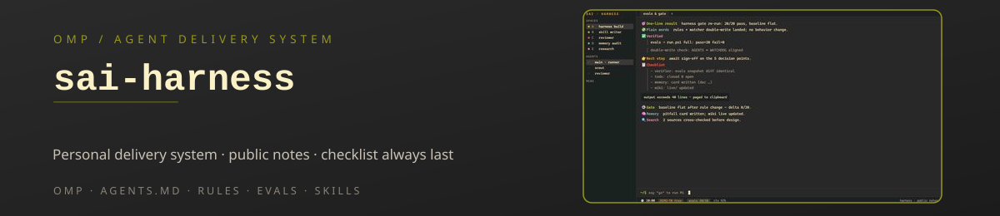
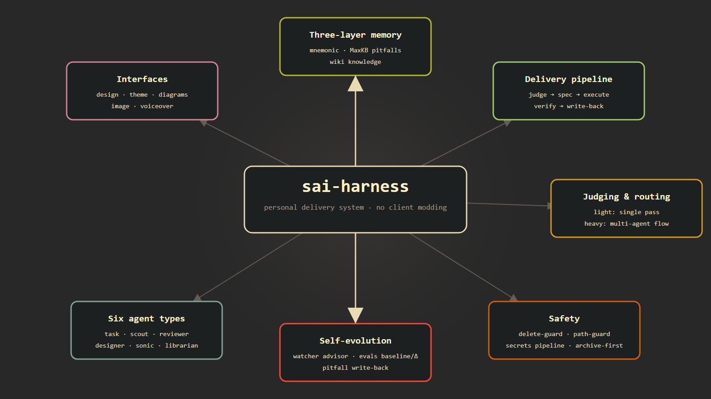

<div align="center">

**🌐 Made by [Sai](https://saaaai.com) · [saaaai.com](https://saaaai.com)** — AI workflow · one homepage

**[English](README.md) · [简体中文](README.zh-CN.md) · [日本語](README.ja.md)**

> English is authoritative; 简体中文 and 日本語 are snapshot translations.

</div>

# sai-harness

> Public notes on an omp / agent delivery system: evidence-based completion · checklist always last



## One-line value

[omp (oh-my-pi)](https://omp.sh) is a programmable agent shell for the terminal — hash-anchored edits, an optimized tool harness, and a TUI that runs anywhere a shell does. On top of it I've built a personal delivery system: every job is judged first — light work runs a single-path contract, heavy work runs a multi-agent flow with an empty-context reviewer — then executed with split-then-merge, verified against disk evidence (self-reported "done" is void), and reported to humans in a fixed emoji five-block spine. Memory is partitioned into three layers instead of one mushy pot; dangerous operations are intercepted at the tool level, not by willpower; and when a rule changes, a deterministic eval suite runs before and after. It's all `AGENTS.md`, `skills/`, `agents/`, `extensions/`, and `evals/` — the repo is the write-up, the map, and the boundary.

## Capability panorama



The map is an overview sketch; details are authoritative in this text.

## Why it's different

A stock omp install already writes code, runs commands, speaks MCP, opens priced agents. I didn't invent a second harness. The gap is discipline: how jobs are judged, how memory is partitioned, how complex work is split and merged, how completion is evidenced, and whether "I think it's fine" counts as done. The method is tool-independent; the omp build below is a concrete, working instance of it.

### Principles

1. **Short map, deep flow.** Top rules only route; heavy process goes into skills. The map you read at boot stays small enough to actually be read.
2. **Completion is evidenced.** Disk state, command results, verification receipts decide. A plan that "feels done" is not done.
3. **Subagents specialize.** The one judging doesn't QA; the one QA-ing doesn't write the final copy; the one writing doesn't review itself. Empty-context reviewers audit the heavy claims.
4. **Memory is partitioned.** Working notes, mistake cards, knowledge wiki, and design/theme libraries are not one pot. Each layer has one owner and one format.
5. **Errors must die thoroughly.** Fixing the artifact is half; the root cause — a rule or a check — must change too, with a recurrence-failing sensor.
6. **Find existing first, hand-roll second.** If a wheel is searchable, don't reinvent it by default.
7. **Talk like a colleague.** Lead with the result; self-verification is clicking, refreshing, listening, watching — not a wall of commands dumped on you.
8. **Default to split-and-return, not meeting.** Independent probe/build goes parallel, results return to main, merge lands on disk. Only genuine debate or large homogeneous batches escalate.
9. **Whole packages only.** "Do it" means the whole checked plan, not à-la-carte half-pieces; a sign-off ticket has exactly three answers: do it / change the plan / hold.

### Quick reference: default vs mine

| | Default omp | This setup |
|--|------------|-----------|
| Positioning | A strong terminal coding agent | A personal delivery harness |
| Memory | Session + auto notes | Three layers: working · mistake cards · knowledge wiki |
| Multi-step tasks | Runs when you let it | Judged first: light vs heavy contract |
| Complex parallelism | Tends to one-person-everything | Defaults split-and-return; merge lands as a file |
| Completion | Self-reported | Disk-checked; light = self-verified, heavy = independent reviewer |
| Research | Ad-hoc search | Shallow/deep tiers via the search skill |
| After errors | Fixes the same spot | Fixes artifact + root rule + a check |
| Speaking to humans | Structure drifts | Fixed five-block spine, checklist always last |
| Harness changes | By feel | Golden evals baseline → delta before/after |
| Volume | Clean shell | ~scores of skills, six agent types, hard gates |

## Core methodology

### Architecture

```
You
 └─ Main control session (reads AGENTS.md map, judges, dispatches, closes out, writes back)
     ├─ Judging: light → chain/loop; heavy → multi-agent flow + empty-context reviewer
     ├─ Rules: AGENTS.md (short map) + contracts (light / heavy) + snapshot-layer rules
     ├─ Memory: working memory ↔ MaxKB-like mistake cards ↔ wiki knowledge graph
     ├─ Agents: task / scout / reviewer / designer / sonic / librarian
     ├─ Skills: entry for design, media, remote, knowledge, evolution
     ├─ Hard guards: delete-guard, path-guard (tool-level, block not warn)
     ├─ Eval: golden suite with baseline → delta on every harness change
     └─ Interfaces: browser, terminal, design/theme/library, message bridge
```

### Judging & orchestration (no shell swap)

Talk about "agent graphs" online usually boils down to: don't do it all yourself, split when you should, merge after splitting, and watch the merge land.

I didn't swap in an external graph engine. I wrote **two contracts** and a judge in front:

| Mechanism | When | What it guarantees |
|---|---|---|
| **Judging / routing** | Every job, first step | Classifies the task, decides who works, single-threaded main control |
| **Light contract** | Small, low-risk, few files | Task engine with stage dependencies; mechanical self-verification is enough |
| **Heavy contract** | Anything else | Multi-agent fan-out, empty-context reviewer, gate on claims |
| **Split-and-return** | Independent probes/builds | Subagents run in parallel, results return to the main session for merge |
| **Merge gate** | Multi-path work | Several parallel paths must produce a merged artifact on disk, not a meeting summary |
| **No war-room escalation** | Simple jobs | Forcing heavy topology on trivial questions is blocked by the judge |

Your felt experience: multi-step work is steadier and returns evidence; small things stay one-threaded instead of staging a committee.

### Completion: evidence all the way

A job that looks done isn't done until:

1. **Runs / is observable** — exit codes pass, files exist where claimed
2. **A human can tell** — artifact opened, full path reported, long runs report progress
3. **Todo is zero** — no open checklist items (check list view yourself)
4. **Sinking** — lessons/decisions landed in their source of truth (wiki / mistake card / template)
5. **When heavy: reviewer approved** — independent empty-context reviewer, cross-model

A crash requires a **double fix**: fix this artifact *and* fix the root cause (a rule or a check). Patching the file and moving on doesn't count.

### Reporting spine (talking to humans)

Each message is a work order. Deliveries use a fixed five-block spine, in order, with the **checklist always last**:

| Block | What it holds |
|---|---|
| 🎯 One-line result | Done / the conclusion / stuck where |
| 🧩 Human explanation | What happened, how it was handled, what was explicitly not done |
| ✅ Effect & self-verification | What you'd feel + how it was confirmed (clicked / refreshed / listened / watched) |
| 👉 Next step | Closable? Say so. Not enough? The full next concrete step |
| 📋 Checklist (always last) | Verifier / todo / memory / wiki — the agent's own audit, not a "got it" nod |
| (extra as needed) | Where to open, full text location, risk, sign-off… |

Options, when given, each explain (what it means / what it costs / how it satisfies your goal). Plans ship as whole packages, never à-la-carte menus.

### Memory: three layers

| Layer | Owner | Format | Practical use |
|---|---|---|---|
| **Working memory** | The agent bank | Recent + preference rules | Context at the front of a session |
| **Mistake cards** | MaxKB-style cards | Short lessons + recurrence fingerprint | Checked first for similar past work |
| **Knowledge graph** | Wiki / long-form | One current version per topic | Research and manuals live here; old versions go to history |

Designs, topics, and reusable demos have their own theme library that only accepts what actually got used. Agents write back to memory themselves; the question is never asked twice.

### Resilience & safety

- Dangerous git, destructive deletes, direct key reads: **tool-level interdiction**, not warnings.
- Secrets: an encrypted-managed pipeline; keys never enter the conversation body or logs.
- After compression, key rules are re-injected; the map stays small enough to re-read.
- Snapshots and archives are first-class: before any big edit, back up; trash goes to one archive root.
- A golden eval suite runs baseline → delta on every harness change; regression = not done.

### Looking outward

External search, browser, remote operations, scheduled jobs: all are extended feelers on the harness, not a second brain. New implementations: default to finding existing first (open-source weighted), only write your own when nothing fits, and write down what you searched and why not used.

## This repo

**Has** — this write-up, the capability map, the hero, later: sanitized templates and copyable checklists.

**Doesn't have, and never will**
- API Keys, Cookies, Tokens, account pools
- Intranet addresses, private hostnames, customer data
- Config that connects to my production
- A "install this and you're as strong as me" script — the method is copyable; your pitfalls and muscle aren't

## Quick start

Add on top of the official extension points:

| Step | What to do |
|------|-----------|
| 1 | Write a short, hard `AGENTS.md`: iron rules + routing table; heavy flow lives in files |
| 2 | Add a judge: decide which contract a job uses (light/loop or heavy/multi-agent) |
| 3 | Split repeating flows into skills (delivery, search, evolution to start) |
| 4 | Add two read-only agents: scout (inspect) and reviewer (claims) |
| 5 | Weld shut your most-feared mistakes with extensions, not with prose |
| 6 | Split memory: working vs mistakes vs knowledge — three files, three owners |
| 7 | Completion = observable evidence + human voice; self-reported "done" is void |
| 8 | Same error twice → change a rule and leave a recurrence-failing check |
| 9 | Fix the reporting spine (result → plain words → verified → next → checklist always last) |
| 10 | Baseline the evals before you change the map; re-run after |

Official material:
- [oh-my-pi (omp)](https://github.com/can1357/oh-my-pi) — the terminal harness I build on
- [omp.sh](https://omp.sh) — player reference
- [AGENTS.md spec](https://agents.md) — the map-file format many shells understand

**Who it's for** — people who run a terminal agent long-term and want to publish/polish their own workflow; the layering (methodology, contract, executor, data) is copyable to anywhere. For browsing-only visitors, Architecture + Principles are enough.

**Not for** — one-click install crowd, key/account hunters, or anyone treating this as the official docs of any company. None of that is here.

## Table of contents

- [One-line value](#one-line-value)
- [Capability panorama](#capability-panorama)
- [Why it's different](#why-its-different)
- [Core methodology](#core-methodology)
  - [Architecture](#architecture)
  - [Judging & orchestration (no shell swap)](#judging--orchestration-no-shell-swap)
  - [Completion: evidence all the way](#completion-evidence-all-the-way)
  - [Reporting spine (talking to humans)](#reporting-spine-talking-to-humans)
  - [Memory: three layers](#memory-three-layers)
  - [Resilience & safety](#resilience--safety)
  - [Looking outward](#looking-outward)
- [This repo](#this-repo)
- [Quick start](#quick-start)
- [License & acknowledgements](#license--acknowledgements)

## License & acknowledgements

Public-notes repo. Text is quotable, ideas adaptable; citing the source is nicer. The method is open; the private layers they run on aren't. Not an official document of any vendor; don't paste private config into a public repo.

Personal harness, public notes.